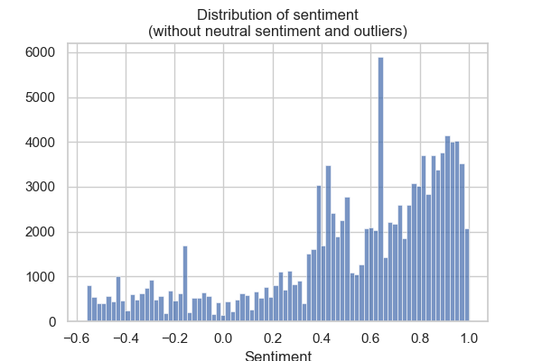

# Final Project
[GitHub]()

## Introduction
In 2017 Lucas LaRochelle created Queering The Map as part of a class project. This is a "community generated counter-mapping platform for digitally archiving LGBTQ2IA+ experience in relation to physical space", whose purpose is provide a safe space for queer people around the globe to share experiences anonimously, and link them to a physical space.

The information of the page arises this question:

**
How does race, gender, sexuality, citizenship, ability, and class affect the ways in which we relate to, move through, and create space?
**

The purpose of this project is to give some insights in the process of answering this question, respecting the anonimity of the community involved, thorugh the analysis of the discourse of the shared experiences and it's relationship with the physical space defined by each country.

## Questions:
- How is the sentiment of the comments found in the web?
    - How is it by country?
- How many characters do people use and what's the emotionality of the comments found in the web?
    - How are they by country?
- How are the communities we can find within a country?
- How do they relate to the countries' characteristics?
- What are the variables that affect the most to the metrics of the comments found in the web?

## Characteristics of the discourse

| language | count |
|----------|-------|
en | 142688
fr | 1696
es | 1303
de | 427
pt | 317
it | 295
nl | 274
et | 272
da | 217
ru | 202

